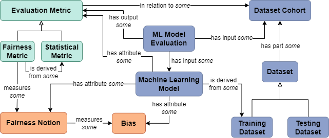
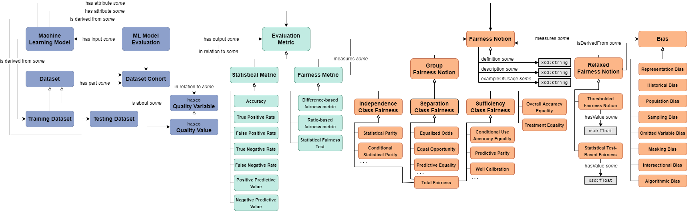

# Fairness Metrics Ontology

The Fairness Metrics Ontology (FMO) is an OWL2 ontology for the standardized representation of fairness metrics, fairness notions, and related machine learning concepts (including bias mitigation algorithms, machine learning models, and statistical metrics). Its primary goal is to guide AI/ML developers in the measurement and interpretation of ML model fairness, as well as to aid ML fairness researchers by cataloguing emerging concepts in the field in a standardized and provenance-aware way. FMO has been designed from the ground up to fully support semantic technologies, including reasoning based on OWL2 restrictions, question-answering through description logic or SPARQL queries, and the instantiation of classes as individuals in an RDF knowledge graph to represent user-specific data.

FMO consists of three ontologies: one for classification (FMO-C or FMO-Class), one for regression (FMO-R), and one for clustering (FMO-Clust). The initial version of FMO, dubbed the Fairness Metrics Ontology for Classification (FMO-C), was released on August 2nd 2022. An updated version, the Fairness Metrics Ontology for Regression and Machine Learning (FMO-R), was released on May 9, 2023, and includes new concepts for the representation of fairness in regression as well as updates to the original FMO-C architecture. The latest version, (FMO-Clust), was made available on April 1st, 2024. For more information, see [Version History](https://github.com/frankj-rpi/fairness-metrics-ontology/blob/main/README.md#version-history).

## FMO Explorer

With our explorer, you can filter out different notions and metrics according to different requirements, and view the groups of notions and metrics that match these requirements. To view the Fairness Metrics Explorer, visit <https://inciteprojects.idea.rpi.edu/fairness/app/fairness/>. 

## FMO Structure

For a short paper to give a quick introduction, see [our US2TS abstract](https://homepages.rpi.edu/~frankj6/US2TS-2022-Towards_an_Ontology_for_Fairness_Metrics.pdf). For more in-depth information on the ontology as a whole, see [An Ontology for Fairness Metrics](https://dl.acm.org/doi/10.1145/3514094.3534137), our  AIES '22 conference paper, or [its accompanying poster](https://homepages.rpi.edu/~frankj6/aies22.html). For information on FMO-R or the explorer specifically, see [An Ontology for Reasoning about Regression in Machine Learning](https://link.springer.com/chapter/10.1007/978-3-031-47745-4_18).

The following is a high-level overview of the fairness metrics ontology:

The full ontology is shown in diagram form below:

## Version History

The following persistent URLs point to the various versions of FMO:

Latest Version (https://purl.org/twc/fmo): This PURL will always point to the most up-to-date version of FMO. The (https://purl.org/heals/fmo) PURL points to the same location.

2023-12-16—FMO-R (https://purl.org/twc/fmo/1.0.1): This is a minor update to FMO-R, the Fairness Metrics Ontology for Regression and Machine Learning. The updates were mainly the addition of a few more metrics and notions, as well as some edits to annotations to existing concepts for increased accuracy and compatibility with the fairness metrics browser.

2023-06-17—FMO-R (https://purl.org/twc/fmo/1.0.0): This is the full release version for FMO-R, the Fairness Metrics Ontology for Regression and Machine Learning, as described in the paper FMO-R: An Ontology for Reasoning about Fairness in Regression and Machine Learning (*Published at KGSWC*). Note that FMO-R also includes concepts relating to classification, and a partial coverage of concepts relating to clustering.

2023-05-09—FMO-R (https://purl.org/heals/fmo/1.0.0): This is an earlier PURL for FMO-R, the Fairness Metrics Ontology for Regression and Machine Learning, and points to an earlier release of FMO-R. It includes regression, clustering, and related ML concepts, but has been deprecated in favor of the 2023-06-17 release.

2022-08-02—FMO-C (https://purl.org/heals/fmo/0.0.0): This is the PURL for FMO-C, the Fairness Metrics Ontology for Classification, as described in the initial paper [An Ontology for Fairness Metrics](https://dl.acm.org/doi/10.1145/3514094.3534137). The (https://purl.org/twc/fmo/0.0.0) PURL also points to this location. Note that FMO-C is deprecated; although FMO-R is backwards-compatible with FMO-C, it also includes several updates to the classification notions and therefore we encourage the usage of FMO-R over FMO-C. 

## About Us

The Fairness Metrics Ontology was created through the [Health, Empowerment by Analytics, Learning, and Semantics (HEALS) project](https://idea.rpi.edu/research/projects/heals) through joint collaboration by Rensselaer Polytechnic and IBM, and is partially supported by IBM Research AI through the AI Horizons Network.
