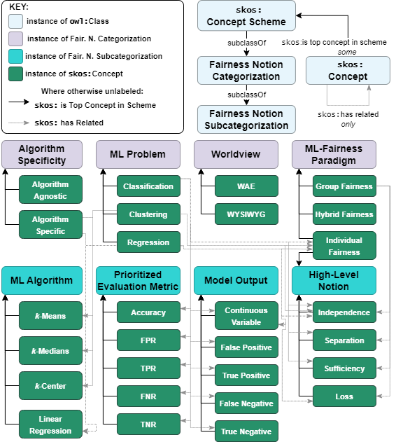

# SKOS Conceptual Hierarchy

The SKOS conceptual hierarchy. Shown are the various concept schemes that are used to organize the ontology, enabling faceted browsing via selective filtering. At the top, the OWL classes that the hierarchy instantiates are shown. The middle of the diagram shows the main categorizations, and the bottom shows the subcategorizations. Dashed lines indicate the `skos:hasRelated` property used to identify when the faceted fairness browser should display a relevant subcategorization. Not all categories from subcategorizations are shown.
